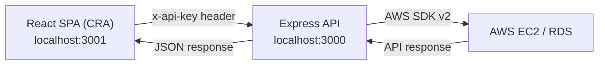

# X-MOP

> A web tool for configuring highly-available AWS deployments — discovering and provisioning EC2/RDS resources (regions, key pairs, security groups, database engines) through a guided React form backed by a Node.js/Express API.

Built by the **Swinburne TIP X-MOP Team**.

## Overview

Manually configuring a highly-available AWS deployment means jumping between the EC2 and RDS consoles to check which regions, key pairs, security groups and database engine versions are actually available before you can provision anything. X-MOP collects that into a single form: as you pick a region, the form calls a small Express API that talks to AWS directly and refreshes the available key pairs, security groups and database options for you, rather than relying on a static, out-of-date list.

## Tech Stack

**Frontend**
- React 18 (bootstrapped with Create React App / `react-scripts` 5)
- Sass/SCSS for styling

**Backend**
- Node.js + Express 4
- AWS SDK for JavaScript v2 (`EC2`, `RDS` clients)
- `dotenv` for environment-based configuration

**Testing & Tooling**
- Jest + React Testing Library (via `react-scripts test`)
- A secondary Webpack 5/Babel pipeline is also configured (`webpack.config.js`) for a separate static asset entry point; it runs independently of the main CRA app and is not currently part of the primary build flow.

## Key Features

- **Live AWS region discovery** — populates the region dropdown via EC2 `describeRegions` instead of a hardcoded list.
- **Region-aware key pair lookup** — the form offers select-existing / create-new / import options; selecting "select existing" re-queries the backend for key pairs in the currently selected region.
- **Security group provisioning API** — `POST /create-security-group` creates an EC2 security group and applies custom inbound rules in one call.
- **RDS engine and instance discovery** — `POST /engine_versions` and `POST /instance_types` surface real, region-specific RDS engine versions and matching instance classes.
- **Locked-down backend by default** — every mounted route requires a shared-secret `x-api-key` header and CORS is restricted to a configured frontend origin.

## Architecture



The backend is organised as one Express Router per AWS operation under `backend/routes/`. Each router wraps exactly one AWS SDK call — a thin, single-responsibility mapping from a REST endpoint to an AWS API call, rather than a general-purpose AWS proxy. This keeps each route easy to reason about and test in isolation, at the cost of some repetition (each file sets up its own AWS client). `server.js` currently mounts six of these routers (`getRegion`, `getExistKey`, `getSecurityGroup`, `createSecurityGroup`, `getDBType`, `getEngineVer`); `createKey` and `getAvailabilityZone` are implemented but not yet wired into the running server (see [Current Limitations](#current-limitations)).

**Credential handling.** Earlier revisions of this project configured AWS credentials directly inside each route file. This has been replaced with the AWS SDK's default credential provider chain — credentials are resolved from environment variables or an instance role, never from source. Because this is a tool that can create and modify real AWS infrastructure and has no user-account system of its own, every request is additionally gated behind a single shared-secret API key rather than a full auth system — a reasonable trade-off for an internal/team provisioning tool, but not one that would scale to a multi-tenant product.

## How It Works

The clearest example of the frontend/backend relationship is the region → key pair cascade in `HighlyAvailableDeploymentForm.js`:

1. On mount, the form calls `GET /available_regions`. The backend creates an EC2 client and calls `describeRegions`, returning the live list of AWS regions.
2. When the user chooses "select existing" for the key pair option, a second effect — keyed on `[keyPairOption, awsRegion]` — fires `GET /key-pairs?region=<region>`.
3. The backend creates a **region-scoped** EC2 client (`new AWS.EC2({ region })`) and calls `describeKeyPairs`. Because the effect is keyed on `awsRegion`, changing the selected region automatically re-fetches the key pair list for that region with no extra user action.
4. If the AWS call fails (for example, the configured credentials lack permission in that region), the backend forwards a structured error and the form surfaces a specific "you do not have permission to view key pairs in this region" message rather than a generic failure.

## Getting Started

**Prerequisites:** Node.js and npm, and an AWS account/IAM credentials if you want the AWS-backed features (not required just to explore the UI).

```bash
# 1. Install dependencies (frontend + backend share the root package.json)
npm install

# 2. Configure the backend
cp backend/.env.example backend/.env
# edit backend/.env: AWS_ACCESS_KEY_ID, AWS_SECRET_ACCESS_KEY, AWS_REGION, API_KEY, FRONTEND_ORIGIN

# 3. Configure the frontend
cp .env.example .env
# edit .env: REACT_APP_API_KEY must match API_KEY in backend/.env

# 4. Run the backend (port 3000)
node backend/server.js

# 5. In a second terminal, run the frontend (port 3001)
npm start
```

Then open `http://localhost:3001`.

## Notable Engineering Decisions / Challenges

- **Removing hardcoded AWS credentials.** Every backend route originally embedded a literal `accessKeyId`/`secretAccessKey` pair. These were removed in favour of environment-based configuration. Because the credentials had previously been committed to a public repository, the exposed keys were rotated in AWS, and the full git history was rewritten with `git-filter-repo` to scrub them, followed by a coordinated force-push — a reminder that "hiding" a secret in a later commit doesn't remove it from history.
- **Fail-closed API authentication.** The shared-secret middleware compares the incoming `x-api-key` header against `process.env.API_KEY`. An early version of this check didn't guard against `API_KEY` being unset — if the environment variable was missing, both sides of the comparison were `undefined`, and every request was silently authenticated. This was fixed by making the server refuse to start at all if `API_KEY` isn't configured, rather than failing open.
- **Path traversal in key pair downloads.** The key-pair creation route wrote the AWS-generated private key to `${keyName}.pem` using a user-supplied `keyName` with no validation, allowing path traversal via crafted names. Fixed with a strict allow-list (`^[a-zA-Z0-9_-]+$`) before the file write.

## Current Limitations

- The deployment form captures instance sizing, AMI selection and storage configuration, but submitting the form to actually trigger a deployment is not yet wired up — the current focus is live AWS resource discovery to populate the form correctly.
- Security group rule authoring (the "create new with rules" option) exists as a backend capability (`POST /create-security-group`) but doesn't yet have a corresponding rule-builder UI.
- EC2 key pair generation (`createKey.js`, `POST /download-keypair`) and availability zone discovery (`getAvailabilityZone.js`) are implemented but not currently mounted in `server.js`.

## License

No license has been set for this repository yet. As a Swinburne TIP team project, reuse should be confirmed with the team before it's treated as open source.
